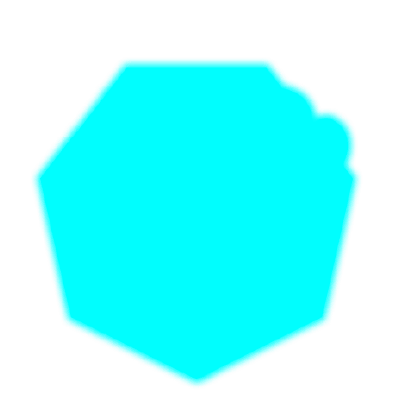
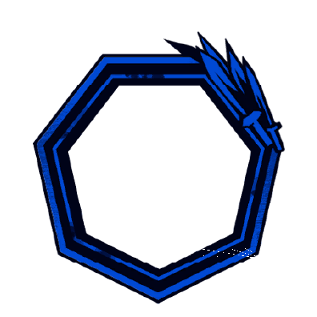
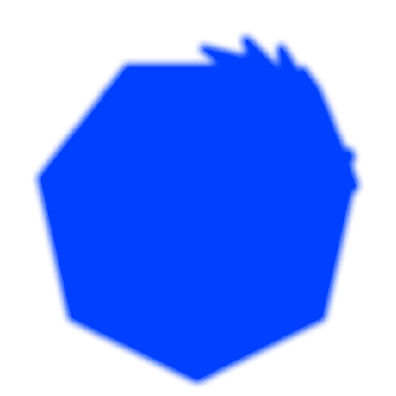
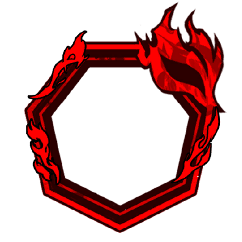
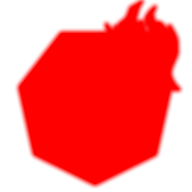

Ações Especiais

      

            
            
            
1

            
      

      

            

                  
                  
                  
            

            
Honras Fúnebres

            

                  
<color ="#00eeff"><b>[Ao Usar]</b> </color><color ="#fff">Ganhe 2 </color>[<u><color ="#948be8">Poise</color></u>]{poise}

                  
<color ="#00eeff"><b>[Ao Usar]</b> </color><color ="#fff">Ganhe +2 </color>[<u><color ="#948be8">Poise</color></u>]{poise} <color="#fff">[Count]{count}</color>

                  
<color ="#fff">Acerto aumentado em +1 para cada 5</color> [</color><u><color ="#ff0000">Bristle</color></u>]{axel_bristle} <color ="#fff">no alvo (Máx. +3)</color>

                  
                  
<color ="#fff">Aplique 1 </color>[ <u><color="#ff0000">Bristle</color></u>]{axel_bristle}   <color ="#FFFF00">[Em um crítico]</color> <color ="#fff">Aplique 1 </color>[ <u><color="#ff0000">Bristle</color></u>]{axel_bristle}

                  
                  
<color ="#fff">Aplique 1 </color>[ <u><color="#ff0000">Bristle</color></u>]{axel_bristle}  <color ="#FFFF00">[Em um crítico]</color> <color ="#fff">Aplique 1 </color>[ <u><color="#ff0000">Bristle</color></u>]{axel_bristle}

                  
                  
<color ="#fff">Aplique 1 </color>[ <u><color="#ff0000">Bristle</color></u>]{axel_bristle}  <color ="#FFFF00">[Em um crítico]</color> <color ="#fff">Aplique d6 + 1 </color>[ <u><color="#ff0000">Bristle</color></u>]{axel_bristle}

            

      

      

      

            
            
            
2

            
      

      

            

                  
                  
            

            
Ordem

            

                  
<color ="#00eeff"><b>[Ao Usar]</b> </color><color ="#fff">Ganhe +3 </color>[<u><color ="#948be8">Poise</color></u>]{poise} <color="#fff">[Count]{count}</color>

                  
                  
<color ="#fff">Aplique 1 </color>[ <u><color="#ff0000">Bristle</color></u>]{axel_bristle}

                  
                  
<color ="#fff">Cause 10 de dano adicional para cada efeito negativo presente no alvo Cause 5 de dano adicional para cada 10 </color> [</color><u><color ="#ff0000">Bristle</color></u>]{axel_bristle}</color> <color="#fff">presente no alvo</color>   <color ="#FFFF00">[Em um crítico]</color> <color="#fff">Ganhe +2</color> [<u><color ="#948be8">Poise</color></u>]{poise} <color="#fff">[Count]{count}</color>

            

      

      
      

      

            
            
            
3

            
      

      

            

                  
            

            
Responda ao Meu Comando!

            

                  
                  
<color ="#fff">Aplique 2 </color>[ <u><color="#ff0000">Bristle</color></u>]{axel_bristle}

                  
<color ="#FFFF00"><b>[Fim do Ataque]</b> </color><color ="#fff">Ganhe 4 </color>[<u><color ="#948be8">Poise</color></u>]{poise}

                  
<color ="#FFFF00"><b>[Fim do Ataque]</b> </color><color ="#fff">Faça com que dois aliados que estejam em até 15 feet de você utilizem em conjunto as suas primeiras ações especiais (a que possui custo 1), onde no fim desse ataque conjunto você ataca mais uma vez.</color>

            

      

  

Passivas

      

            
Mariposa Fantasma [<i>Thysania Agrippina</i>]

            

                  
<color ="#fff">Sua furtividade ganha um bônus de +2 e em um ataque surpresa o seu <b>[ataque fatal]{fatal_attack}</b> causa dano máximo.</color>

            

      

      

      

            
Memórias do Passado

            

                  
<color ="#fff">Ao utilizar uma <b>ação especial</b> contra um alvo com 20+</color> [ <u><color ="#ff0000">Bristle</color></u>]{axel_bristle}<color ="#fff">, converta a última moeda da ação especial para uma </color><color ="#ff0000">[ <u>Unbreakable Coin]{coin_red}</u></color><color="#fff">.</color>

            

      

      

      

            
Experiência Consolidada

            

                  
<color ="#fff">Testes de Furtividade, Percepção e Investigação são feitos com vantagem.</color>

            

      

      

      

            
Admiração Genuína a Mais Bela

            

                  
<color ="#fff">Uma vez por turno você ganha +1 </color> [<u><color ="#948be8">Poise</color></u>]{poise} <color="#fff">[Count]{count} ao acertar um ataque não provindo de uma <b>ação especial</b> (com exceção do ataque final concedido pela ação especial de custo 3).</color>

            

      

      

      

            
Recuperação de Estabilidade

            

                  
<color ="#fff">Uma vez por turno ao acertar um alvo com 40+ </color> [ <u><color ="#ff0000">Bristle</color></u>]{axel_bristle}<color ="#fff">, recupere 10 pontos de vida.</color>

            

      

Evadir

      

            
            
            
0

            
      

      

            

                  
            

            
Uma Pequena Fagulha de Esperança

            

                  
<color ="#FFFF00"><b>[Ao Esquivar]</b> </color><color ="#fff">Ganhe +2 </color>[<u><color ="#948be8">Poise</color></u>]{poise} <color="#fff">[Count]{count} (Máx 2x por turno)</color>

            

      

