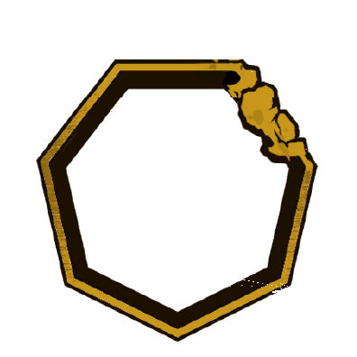
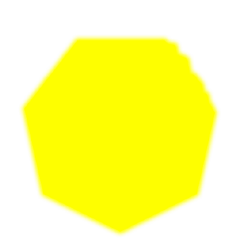

# Axel Weber

Ações Especiais

      

            
            
            
1

            
      

      

            

                  
                  
                  
            

            
Ordem

            

                  
<color ="#fff">Acerto aumentado em +1 para cada 5 Bristle no alvo</color>

                  
                  
<color ="#fff">Aplique 1 </color>[ <u><color="#ff0000">Bristle</color></u>]{axel_bristle} <color="#fff">asda</color>

                  
                  
<color ="#fff">Arroz com farinha!</color>

                  
                  
<color ="#fff">Se o alvo tiver 10+ Bristle, aplique dois.</color>

            

      

      

            
            
            
2

            
      

      

            

                  
            

            
Ordem de Como Matar o Jader

            

                  
<color ="#fff">Acerto aumentado em +1 para cada 5 Cerdas no alvo.</color>

                  
                  
<color ="#fff">Arroz com farinha!</color>

            

      

      

      

            
            
            
3

            
      

      

            

                  
            

            
Ordem de Como Matar o Jader

            

                  
<color ="#fff">Acerto aumentado em +1 para cada 5 Cerdas no alvo.</color>

                  
                  
<color ="#fff">Arroz com farinha!</color>

            

      

  

Passivas

      

            
Ordem

            

                  
<color ="#fff">Acerto aumentado em +1 para cada 5 Cerdas no alvo.</color>

            

      

      

            
Ordem

            

                  
<color ="#fff">Acerto aumentado em +1 para cada 5 Cerdas no alvo.</color>

            

      

Reação Única [ Evadir ]

      

            
            
            
0

            
      

      

            

                  
            

            
<i>Thysania Agrippina</i>

            

                  
<color ="#FFFF00"><b>[Ao esquivar]</b></color><color ="#fff"> Recupere 2 pontos de vida.</color>

            

      

