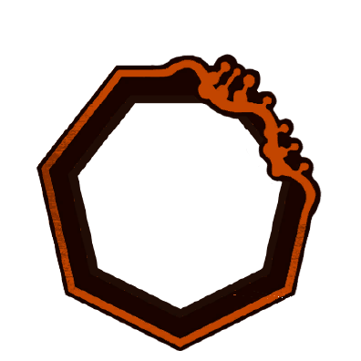
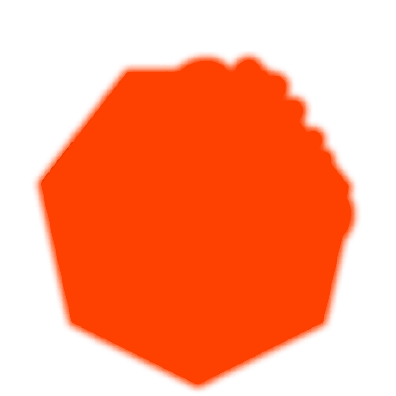
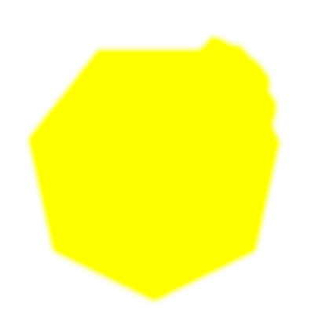
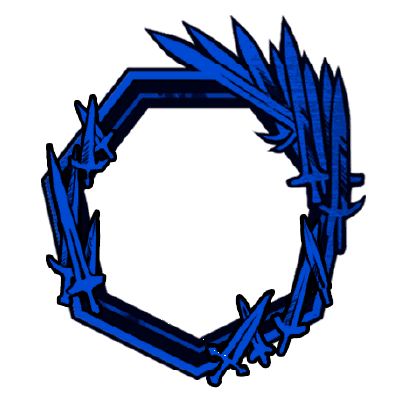
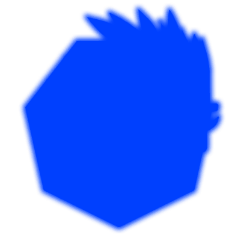
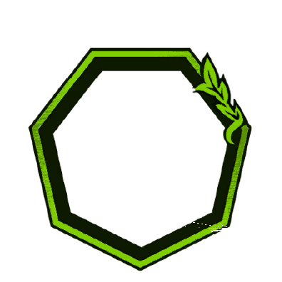
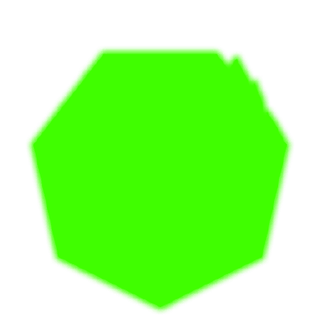

Ações Especiais

      

            
            
            
1

            
      

      

            

                  
                  
                  
                  
            

            
Eu Já Disse Pra Você Ficar Quieto!

            

                  
                  
<color ="#FFFF00">[Em um Acerto] </color><color ="#fff">Aplique 10 </color>[<u><color="#ff0000">Interloper</color></u>]{leonard_interloper}</color>

                  
                  
<color ="#FFFF00">[Em um Acerto] </color><color ="#fff">Aplique 10 </color>[<u><color="#ff0000">Interloper</color></u>]{leonard_interloper}</color>

                  
                  
<color ="#FFFF00">[Em um Acerto] </color><color ="#fff">Aplique 5 </color>[<u><color="#ff0000">Interloper</color></u>]{leonard_interloper}</color> <color ="#FFFF00">[Em um Acerto] </color><color ="#fff">Aplique +1 </color>[<u><color="#ff0000">Interloper</color></u>]{leonard_interloper}</color><color="#fff"> [Count]{count}</color>

                  
                  
<color ="#FFFF00">[Em um Acerto] </color><color ="#fff">Aplique 5 </color>[<u><color="#ff0000">Interloper</color></u>]{leonard_interloper}</color> <color ="#FFFF00">[Em um Acerto] </color><color ="#fff">Aplique +2 </color>[<u><color="#ff0000">Interloper</color></u>]{leonard_interloper}</color><color="#fff"> [Count]{count}</color>

            

      

      

      

            
            
            
2

            
      

      

            

                  
                  
            

            
A Ajuda Tá a Caminho

            

                  
<color ="#00eeff"><b>[Ao Usar]</b> </color><color ="#fff">Ganhe 5 de [shield]{shield}</color>

                  
<color ="#fff">Se o alvo tiver 55+ </color>[<u><color ="#ff0000">Cyclical Karma</color></u>]{leonard_cyclicalkarma} <color="#fff">+4 de acerto</color>

                  
<color ="#fff">Se o alvo tiver </color>[<u><color ="#ff0000">Interloper</color></u>]{leonard_interloper} <color="#fff">+4 de acerto</color>

                  
                  
<color ="#FFFF00">[Em um Acerto] </color><color ="#fff">Conceda 1 dos 3 seguintes efeitos a um aliado que esteja em até 30 feet de você:  - 5 de [shield]{shield} - 10 feet de movimento adicional no seu próximo turno - d4 adicional para uma rolagem (1x por aliado)</color> <color ="#FFFF00">[Em um Acerto] </color><color="#fff">Cure 5 de <u>vida</u> de um aliado que esteja em até 30 feet de você</color> <color ="#FFFF00">[Em um Acerto] </color><color="#fff">Cure 5 de <u>[stagger]{stagger}</u> de um aliado que esteja em até 30 feet de você</color>

                  
                  
<color ="#FFFF00">[Em um Acerto] </color><color ="#fff">Aumente a [Potência]{potency} do efeito de um aliado no seu campo de visão em +1 (quando possível)</color> <color ="#FFFF00">[Em um Acerto] </color><color ="#fff">Aumente a [Count]{count} do efeito de um aliado no seu campo de visão em +1 (quando possível)</color>

            

      

      

      

            
            
            
3

            
      

      

            

                  
            

            
O Destino é Cruel...

            

                  
                  
<color ="#FFFF00">[Em um Acerto] </color><color ="#fff">Aplique 1 </color>[<u><color="#ff0000">Karmic Consequence</color></u>]{leonard_karmicconsequence}</color><color="#fff"> (3x por turno)</color> <color ="#FFFF00">[Em um Acerto] </color><color ="#fff">Aplique 1 </color>[<u><color="#ff0000">Cyclical Karma</color></u>]{leonard_cyclicalkarma}

            

      

  

Passivas

      

            
Pibble Promete Que Vai Te Proteger 😋

            

                  
<color ="#fff">Quando um combate começa você ganha </color><color ="#948be8">[ <u>Important To Me]{leonard_importanttome}</u></color><color="#fff">.</color>

            

      

      

      

            
Pibble Vai Te Ajudar

            

                  
<color ="#fff">Quando um combate começa Pibble te concede 15 de [shield]{shield} e um dos seguintes benefícios: 1 </color><color ="#948be8">[ <u>Power Up]{power_up}</u></color><color="#fff"> ou 1 </color><color ="#948be8">[ <u>Armor]{armor}</u></color><color="#fff"> <color="#fff"> por todo o combate.</color>

            

      

      

      

            
Pibble Agora Vai Ajudar Vocês

            

                  
<color ="#fff">Quando um combate começa Pibble concede os seguintes benefícios para todos os seus aliados por dois turnos: 2 </color><color ="#948be8">[<u>Haste]{haste}</u></color><color="#fff"> e 1 </color><color ="#948be8">[<u>Armor]{armor}</u></color><color="#fff">.</color>

            

      

      

      

            
Acostumado Com Esse Inferno

            

                  
<color ="#fff">As primeiras 4x que um efeito negativo seria aplicado em você, o ignore.</color>

            

      

      

      

            
Residente

            

                  
<color ="#fff">Testes de Sobrevivência, Prestidigitação e Intuição são feitos com vantagem.</color>

            

      

Evadir

      

            
            
            
0

            
      

      

            

                  
            

            
Isso é Muito Complicado

            

                  
<color ="#FFFF00"><b>[Ao Esquivar]</b> </color><color ="#fff">Se o alvo tiver 6+ </color>[<u><color="#ff0000">Karmic Consequence</color></u>]{leonard_karmicconsequence} <color="#fff"> utilize a ação especial <i>O Destino é Cruel...</i> (Máx. 1x por turno)</color>

                  
<color ="#FFFF00"><b>[Ao Esquivar]</b> </color><color ="#fff">Recupere 3 de [stagger]{stagger}</color>

            

      

