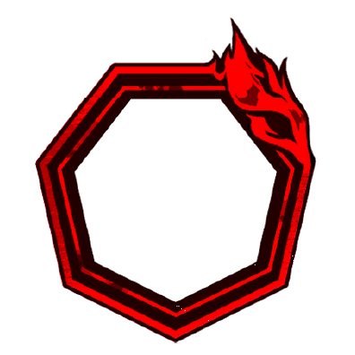
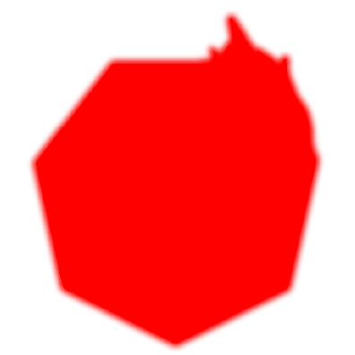
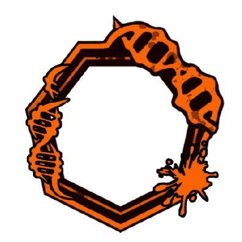
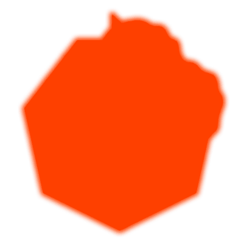

Ações Especiais

      

            
            
            
1

            
      

      

            

                  
                  
                  
                  
            

            
Esse é o Resultado de Minhas Escolhas

            

                  
<color ="#00eeff"><b>[Ao Usar]</b> </color><color ="#fff">Consuma até 50</color>[<u><color ="#948be8">Bloodfeast</color></u>]{viktor_bloodfeast}<color="#fff"> e ganhe 1 </color>[<u><color ="#948be8">Hardblood</color></u>]{viktor_hardblood} <color ="#fff">para cada 10</color>[<u><color ="#948be8">Bloodfeast</color></u>]{viktor_bloodfeast} <color="#fff"> consumido - Se falhar em consumir</color>[<u><color ="#948be8">Bloodfeast</color></u>]{viktor_bloodfeast}<color="#fff">, ganhe 5 </color>[<u><color ="#ff0000">Bleed</color></u>]{bleed}

                  
<color ="#00eeff"><b>[Ao Usar]</b></color><color="#fff"> Acerto aumentado em +1 para cada 5 </color>[<u><color ="#ff0000">Bleed</color></u>]{bleed}<color="#fff"> no alvo (Máx. +2)</color>

                  
<color ="#fff">Com 10+</color>[<u><color ="#948be8">Hardblood</color></u>]{viktor_hardblood} <color="#fff">converta todas as moedas dessa ação especial para </color> [<u><color ="#948be8">Unbreakable Coins</color></u>]{coin_red}

                  
<color ="#fff">Ao acertar um ataque recupere 3 pontos de vida (se o alvo for um ser vivo)</color>

                  
                  
<color ="#FFFF00">[Em um Acerto] </color><color ="#fff">Aplique 5 </color>[<u><color="#ff0000">Bleed</color></u>]{bleed}</color>

                  
                  
<color ="#FFFF00">[Em um Acerto] </color><color ="#fff">Aplique 5 </color>[<u><color="#ff0000">Bleed</color></u>]{bleed}</color>

                  
                  
<color ="#FFFF00">[Em um Acerto] </color><color ="#fff">Aplique 5 </color>[<u><color="#ff0000">Bleed</color></u>]{bleed}</color>

                  
                  
<color ="#FFFF00">[Em um Acerto] </color><color ="#fff">Aplique 5 </color>[<u><color="#ff0000">Bleed</color></u>]{bleed}</color> <color ="#FFFF00">[Em um Acerto] </color><color ="#fff">Aplique +1 </color>[<u><color="#ff0000">Bleed</color></u>]{bleed}</color> <color="#fff"> [Count]{count}</color> <color ="#FFFF00">[Em um Acerto] </color><color ="#fff">Aplique </color>[<u><color="#ff0000">Bloodied</color></u>]{viktor_bloodied}</color>

            

      

    

      

            
            
            
2

            
      

      

            

                  
                  
                  
            

            
O Fervor do Sangue é Algo que Jamais Me Esquecerei

            

                  
<color ="#00eeff"><b>[Ao Usar]</b> </color><color ="#fff">Consuma até 50</color>[<u><color ="#948be8">Bloodfeast</color></u>]{viktor_bloodfeast}<color="#fff"> e ganhe 1 </color>[<u><color ="#948be8">Hardblood</color></u>]{viktor_hardblood} <color ="#fff">para cada 10</color>[<u><color ="#948be8">Bloodfeast</color></u>]{viktor_bloodfeast} <color="#fff"> consumido - Se falhar em consumir</color>[<u><color ="#948be8">Bloodfeast</color></u>]{viktor_bloodfeast}<color="#fff">, ganhe 5 </color>[<u><color ="#ff0000">Bleed</color></u>]{bleed}

                  
<color ="#00eeff"><b>[Ao Usar]</b></color><color="#fff"> Acerto aumentado em +2 para cada 5 </color>[<u><color ="#ff0000">Bleed</color></u>]{bleed}<color="#fff"> no alvo (Máx. +4)</color>

                  
<color ="#fff">Com 15+</color>[<u><color ="#948be8">Hardblood</color></u>]{viktor_hardblood} <color="#fff">converta todas as moedas dessa ação especial para </color> [<u><color ="#948be8">Unbreakable Coins</color></u>]{coin_red}

                  
<color ="#fff">Ao acertar um ataque recupere 3 pontos de vida (se o alvo for um ser vivo)</color>

                  
                  
<color ="#FFFF00">[Em um Acerto] </color><color ="#fff">Aplique +2 </color>[<u><color="#ff0000">Bleed</color></u>]{bleed}</color> <color="#fff"> [Count]{count}</color>

                  
                  
<color ="#FFFF00">[Em um Acerto] </color><color ="#fff">Aplique +2 </color>[<u><color="#ff0000">Bleed</color></u>]{bleed}</color> <color="#fff">[Count]{count}</color>

                  
                  
<color="#fff">Se você estiver com 10+</color>[<u><color="#948be8">Hardblood</color></u>]{viktor_hardblood}</color> <color="#fff"> converta este ataque para um [<u>ataque em área</u>]{area_attack} que acerta até 4 criaturas distintas dentro de um alcance de 25 feet</color> <color ="#FFFF00">[Em um Acerto] </color><color ="#fff">Aplique +2 </color>[<u><color="#ff0000">Bleed</color></u>]{bleed}</color> <color="#fff"> [Count]{count}</color> <color ="#FFFF00">[Em um Acerto] </color><color ="#fff">Cause dano adicional igual a </color>[<u><color="#ff0000">Bleed</color></u>]{bleed}</color> <color="#fff"> no alvo</color>

            

      

    

      

            
            
            
3

            
      

      

            

                  
                  
                  
            

            
A Lança Capaz de Perfurar Até Mesmo os Céus

            

                  
<color ="#00eeff"><b>[Ao Usar]</b></color><color="#fff"> Se o alvo tiver </color>[<u><color ="#ff0000">Bleed</color></u>]{bleed}<color="#fff"> aumente o acerto em +6</color>

                  
<color ="#fff">Com 15+</color>[<u><color ="#948be8">Hardblood</color></u>]{viktor_hardblood} <color="#fff">converta todas as moedas dessa ação especial para </color> [<u><color ="#948be8">Unbreakable Coins</color></u>]{coin_red}

                  
<color ="#fff">Com 20 </color>[<u><color ="#948be8">Hardblood</color></u>]{viktor_hardblood} <color="#fff">você pode converter essa ação especial para <i>Artes da Besta Sangrenta - 7ª Técnica: Lança Ascendente Sangrenta</i></color>

                  
<color ="#fff">Ao acertar um ataque recupere 7 pontos de vida (se o alvo for um ser vivo)</color>

                  
                  
<color ="#FFFF00">[Em um Acerto] </color><color ="#fff">Aplique 5 </color>[ <u><color="#ff0000">Bleed</color></u>]{bleed}</color> <color ="#FFFF00">[Em um Acerto] </color><color ="#fff">Aplique +2 </color>[ <u><color="#ff0000">Bleed</color></u>]{bleed} <color="#fff"> [Count]{count}</color>

                  
                  
<color ="#FFFF00">[Em um Acerto] </color><color ="#fff">Cause 5 de dano adicional para cada 10+</color>[<u><color="#ff0000">Bleed</color></u>]{bleed}</color><color="#fff"> no alvo</color> <color ="#FFFF00">[Em um Acerto] </color><color ="#fff">Ative o </color>[ <u><color="#ff0000">Bleed</color></u>]{bleed} <color="#fff"> no alvo 3x então reduza a [Count]{count} do </color>[<u><color="#ff0000">Bleed</color></u>]{bleed}<color="#fff"> em 1</color>

                  
                  
<color ="#FFFF00">[Em um Acerto] </color><color ="#fff">Cause 5 de dano adicional para cada 10+</color>[<u><color="#ff0000">Bleed</color></u>]{bleed}</color><color="#fff"> no alvo</color> <color ="#FFFF00">[Em um Acerto] </color><color ="#fff">Ative o </color>[ <u><color="#ff0000">Bleed</color></u>]{bleed} <color="#fff"> no alvo 3x então reduza a [Count]{count} do </color>[<u><color="#ff0000">Bleed</color></u>]{bleed}<color="#fff"> em 1</color>

            

      

    

      

            
            
            
?

            
      

      

            

                  
                  
                  
                  
            

            
Artes da Besta Sangrenta - 7ª Técnica: Lança Ascendente Sangrenta

            

                  
<color ="#00eeff"><b>[Ao Usar]</b></color><color ="#fff"> Consuma 10 </color>[<u><color ="#948be8">Hardblood</color></u>]{viktor_hardblood}

                  
<color ="#00eeff"><b>[Ao Usar]</b></color><color="#fff"> Aplique 10 </color>[<u><color ="#ff0000">Bleed</color></u>]{bleed}</color> <color="#fff"> e +5 </color>[<u><color ="#ff0000">Bleed</color></u>]{bleed} <color="#fff"> [Count]{count} no alvo</color>

                  
<color ="#fff">Se o alvo morrer antes do último ataque ser realizado recupere 25% da sua vida máxima e [<u>stagger</u>]{stagger}, no fim do seu turno você ganha 5 </color>[<u><color ="#948be8">Hardblood</color></u>]{viktor}

                  
                     
<color ="#FFFF00">[Em um Acerto] </color><color ="#fff">Cause 5 de dano adicional para cada 10+</color>[<u><color="#ff0000">Bleed</color></u>]{bleed}</color><color="#fff"> no alvo</color> <color ="#FFFF00">[Em um Acerto] </color><color ="#fff">Ative o </color>[ <u><color="#ff0000">Bleed</color></u>]{bleed} <color="#fff"> no alvo 2x </color>

                  
                     
<color ="#FFFF00">[Em um Acerto] </color><color ="#fff">Cause 5 de dano adicional para cada 10+</color>[<u><color="#ff0000">Bleed</color></u>]{bleed}</color><color="#fff"> no alvo</color> <color ="#FFFF00">[Em um Acerto] </color><color ="#fff">Ative o </color>[ <u><color="#ff0000">Bleed</color></u>]{bleed} <color="#fff"> no alvo 2x </color>

                  
                     
<color ="#FFFF00">[Em um Acerto] </color><color ="#fff">Cause dano adicional igual a </color>[<u><color="#ff0000">Bleed</color></u>]{bleed}</color><color="#fff"> no alvo</color> <color ="#FFFF00">[Em um Acerto] </color><color ="#fff">Ative o </color>[ <u><color="#ff0000">Bleed</color></u>]{bleed} <color="#fff"> no alvo 2x </color>

                  
                     
<color ="#FFFF00">[Em um Acerto] </color><color ="#fff">Cause dano adicional igual a </color>[<u><color="#ff0000">Bleed</color></u>]{bleed}</color><color="#fff"> no alvo</color> <color ="#FFFF00">[Em um Acerto] </color><color ="#fff">Ative o </color>[ <u><color="#ff0000">Bleed</color></u>]{bleed} <color="#fff"> no alvo 2x </color> <color ="#FFFF00">[Em um Acerto] </color><color ="#fff">Cause dano adicional igual a (</color>[<u><color="#ff0000">Bleed</color></u>]{bleed} <color="#fff"> x </color>[<u><color="#ff0000">Bleed</color></u>]{bleed}<color="#fff"> [Count]{count} )</color> <color="#fff"> e então reduza a </color>[<u><color="#ff0000">Bleed</color></u>]{bleed} <color="#fff">[Count]{count} pela metade</color>
                     
            

      

Passivas

      

            
Bloodfiend - Third Kindred

            

                  
<color ="#fff"> Você tem resistência a </color>[<u><color="#ff0000">Bleed</color></u>]{bleed}<color="#fff">, não podendo ter sua vida reduzida abaixo de 1 por dano de </color>[<u><color="#ff0000">Bleed</color></u>]{bleed}<color="#fff">.</color>

            

      

      

      

            
O Único Sobrevivente...

            

                  
<color ="#fff">Se no início do seu turno você não tiver </color>[<u><color ="#948be8">Hardblood Armor</color></u>]{viktor_hardbloodarmor} <color="#fff">, ganhe 5</color> [<u><color ="#948be8">Hardblood Armor</color></u>]{viktor_hardbloodarmor}<color="#fff">.</color>

            

      

      

      

            
Besta Sangrenta

            

                  
<color ="#fff">Quando um aliado utilizar uma ação especial pela primeira vez no seu turno, ganhe 1</color> [<u><color ="#948be8">Hardblood</color></u>]{viktor_hardblood}<color="#fff">.</color>

            

      

      

      

            
Eu... Eu... Sinto... Eu... Sinto Muito

            

                  
<color ="#fff">Você tem vantagem em salvaguardas de constituição.</color>

            

      

Clash

      

            
            
            
0

            
      

      

            

                  
            

            
Perdição

            

                  
<color ="#00eeff"><b>[Ao Usar]</b> </color><color ="#fff">Consuma até 50</color>[<u><color ="#948be8">Bloodfeast</color></u>]{viktor_bloodfeast}<color="#fff"> e ganhe 1 </color>[<u><color ="#948be8">Hardblood</color></u>]{viktor_hardblood} <color ="#fff">para cada 10</color>[<u><color ="#948be8">Bloodfeast</color></u>]{viktor_bloodfeast} <color="#fff"> consumido - Se falhar em consumir</color>[<u><color ="#948be8">Bloodfeast</color></u>]{viktor_bloodfeast}<color="#fff">, ganhe 5 </color>[<u><color ="#ff0000">Bleed</color></u>]{bleed}

                  
<color ="#fff">Com 10+</color>[<u><color ="#948be8">Hardblood</color></u>]{viktor_hardblood} <color="#fff">converta todas as moedas dessa reação especial para </color> [<u><color ="#948be8">Unbreakable Coins</color></u>]{coin_red}

                  
<color ="#fff">Ao acertar um ataque recupere 3 pontos de vida (se o alvo for um ser vivo)</color>

                  
                     
<color ="#FFFF00">[Em um Acerto] </color><color ="#fff">Aplique +2 </color>[<u><color="#ff0000">Bleed</color></u>]{bleed}</color><color="#fff"> [Count]{count}</color> 

            

      

