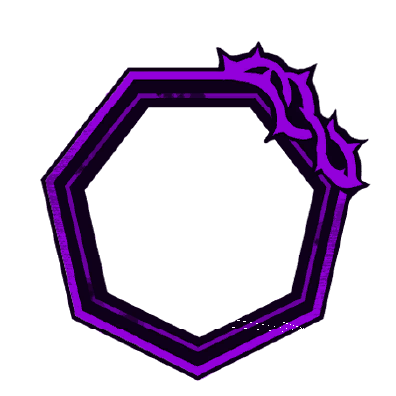
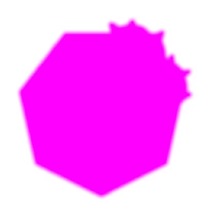
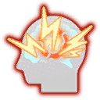
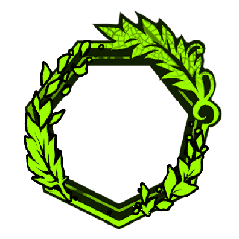
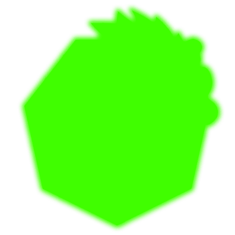
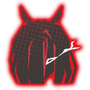

Ações Especiais

      

            
            
            
1

            
      

      

            

                  
                  
            

            
Subjugação [征服]

            

                  
<color ="#00eeff"><b>[Ao Usar]</b> </color><color ="#fff">Ganhe 8 </color>[<u><color ="#948be8">Haste</color></u>]{poise}<color="#fff">, no próximo turno (Máx. 1x por turno)</color>

                  
<color ="#fff">Se a sua speed for superior a do alvo ganhe +1 de acerto</color>

                  
<color ="#fff">Se o alvo tiver</color> [ <u><color="#ff0000">Rupture</color></u>]{rupture} <color="#fff">e</color> [ <u><color="#ff0000">Tremor</color></u>]{tremor} <color="#fff">+1 de acerto</color>

                  
                  
<color ="#FFFF00">[Em um Acerto] </color><color ="#fff">Aplique 1 </color>[ <u><color="#ff0000">Rupture</color></u>]{rupture} <color ="#FFFF00">[Em um Acerto] </color><color ="#fff">Aplique 1 </color>[ <u><color="#ff0000">Tremor</color></u>]{tremor}

                  
                  
<color ="#FFFF00">[Em um Acerto] </color><color ="#fff">Aplique +3 </color>[ <u><color="#ff0000">Rupture</color></u>]{rupture} <color ="#fff">[Count]{count} </color><color ="#FFFF00">[Em um Acerto] </color><color ="#fff">Aplique +3 </color>[ <u><color="#ff0000">Tremor</color></u>]{tremor} <color ="#fff">[Count]{count} </color>

            

      

      

      

            
            
            
2

            
      

      

            

                  
                  
            

            
Golpe da Lâmina Crescente [新月刃击]

            

                  
<color ="#00eeff"><b>[Ao Usar]</b> </color><color ="#fff">Ganhe 2 </color>[<u><color ="#948be8">Haste</color></u>]{poise}<color="#fff">, no próximo turno (Máx. 1x por turno)</color>

                  
<color ="#fff">Se a sua speed for superior a do alvo ganhe +3 de acerto</color>

                  
<color ="#fff">Se o alvo tiver</color> [ <u><color="#ff0000">Rupture</color></u>]{rupture} <color="#fff">ou</color> [ <u><color="#ff0000">Tremor</color></u>]{tremor} <color="#fff">+3 de acerto</color>

                  
                  
<color ="#FFFF00">[Em um Acerto] </color><color ="#fff">Aplique 5 </color>[ <u><color="#ff0000">Rupture</color></u>]{rupture}</color>  <color ="#FFFF00">[Em um Acerto] </color><color ="#fff">Aplique 5 </color>[ <u><color="#ff0000">Tremor</color></u>]{tremor}

                  
                  
<color ="#FFFF00">[Em um Acerto] </color><color ="#fff">Ative </color>[ <u><color="#ff0000">Tremor Burst</color></u>]{tremor_burst}</color><color="#fff"> e reduza a [Count]{count} do</color> [ <u><color="#ff0000">Tremor</color></u>]{tremor} <color="#fff">em 1.</color> <color ="#FFFF00">[Em um Acerto] </color><color="#fff">Aplique 4</color> [ <u><color="#ff0000">Deathrite: Concussion</color></u>]{wuhan_concussion}</color>

            

      

      

      

            
            
            
3

            
      

      

            

                  
                  
                  
            

            
Disparada da Vanguarda de Um Lorde [领主先锋冲刺]

            

                  
<color ="#00eeff"><b>[Ao Usar]</b> </color><color ="#fff">Ganhe </color>[<u><color ="#948be8">Berserker</color></u>]{wuhan_berserker}

                  
<color ="#fff">Se a sua speed for superior a do alvo ganhe +6 de acerto</color>

                  
                  
<color ="#FFFF00">[Em um Acerto] </color><color ="#fff">Aplique 2 </color>[ <u><color="#ff0000">Rupture</color></u>]{rupture}</color>  <color ="#FFFF00">[Em um Acerto] </color><color ="#fff">Aplique 2 </color>[ <u><color="#ff0000">Tremor</color></u>]{tremor}

                  
                  
<color ="#FFFF00">[Em um Acerto] </color><color ="#fff">Ative </color>[ <u><color="#ff0000">Tremor Burst</color></u>]{tremor_burst}</color><color="#fff"> 3x e reduza a [Count]{count} do</color> [ <u><color="#ff0000">Tremor</color></u>]{tremor} <color="#fff">em 2.</color>

                  
                  
<color ="#FFFF00">[Em um Acerto] </color><color ="#fff">Aplique 2 </color>[ <u><color="#ff0000">Rupture</color></u>]{rupture}</color> <color ="#FFFF00">[Em um Acerto] </color><color ="#fff">Aplique 2 </color>[ <u><color="#ff0000">Tremor</color></u>]{tremor} <color ="#FFFF00">[Em um Acerto] </color><color="#fff">Aplique 1</color> [ <u><color="#ff0000">Deathrite: Concussion</color></u>]{wuhan_concussion}</color> <color ="#FFFF00">[Em um Acerto] </color><color="#fff">Cause 10 de dano adicional para cada 2</color>[ <u><color="#948be8">Haste</color></u>]{haste}</color> <color="#Fff">que você possui</color> <color ="#FFFF00">[Em um Acerto] </color><color="#fff">Cause 20 de dano adicional para cada 1</color>[ <u><color="#ff0000">Bind</color></u>]{haste}</color> <color="#Fff">que o alvo possui</color

            

      

Passivas

      

            
Autoridade [权威]

            

                  
<color ="#fff">Toda </color>[<u><color="#ff0000">Rupture</color></u>]{rupture}<color="#fff"> aplicada por você só pode ser reduzida pelos seus ataques.</color>

            

      

      

Clash

      

            
            
            
0

            
      

      

            

                  
            

            
Confrontar [面对]

            

                  
<color ="#00eeff"><b>[Ao Usar]</b> </color><color ="#fff">Ganhe 5 [<u>Shield</u>]{shield}</color>

                  
<color ="#00eeff"><b>[Ao Usar]</b> </color><color ="#fff">Ganhe 1 </color>[<u><color ="#948be8">Haste</color></u>]{haste} <color="#fff">no próximo turno (Máx 2x por turno)</color>

                  
<color ="#FFFF00"><b>[Ao Ganhar Uma Comparação]</b> </color><color ="#fff">Ganhe 1 </color>[<u><color ="#948be8">Haste</color></u>]{haste} <color="#fff">no próximo turno (Máx 2x por turno)</color>

            

      

